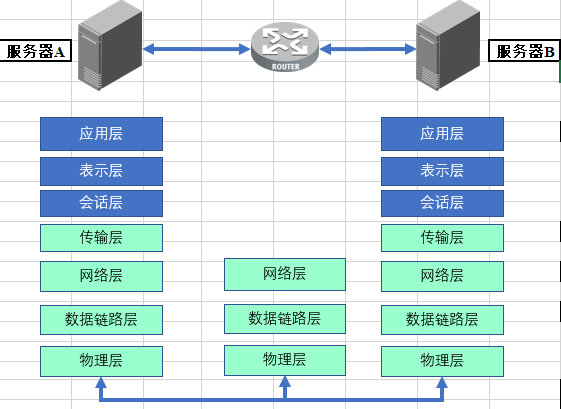
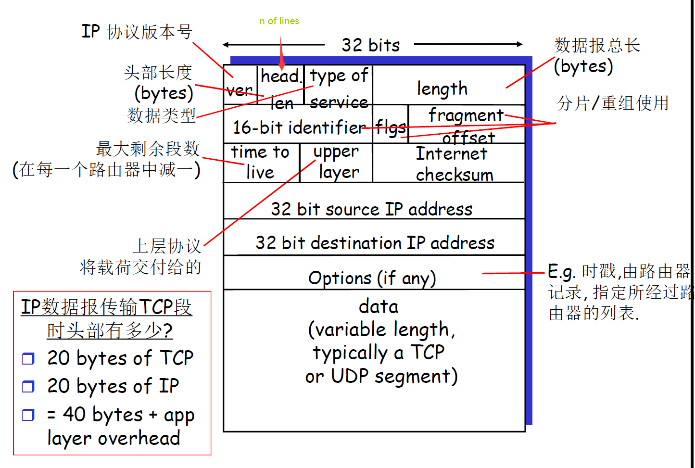

## Bulid you own Sniffer using C++ and MFC

### 工具特点:

基于Wincap + MFC的sniffer 工具，能够抓取流经指定网卡的数据并进行分析，功能如下

1. 支持网卡选定；

2. 丰富的**过滤规则**对网络流量进行过滤

   1. 支持根据原主机目主机的**IP**、或者原目的主机的主机名进行过滤
   2. 支持按照源、目标**端口**过滤
   3. 支持按照**协议类型**过滤（目前支持 **fddi**, **tr**, **ip**, **ip6**, **arp**, **rarp**, **decnet**, **tcp** 和 **udp**. ）
   3. 根据**包长度**进行过滤
   3. 过滤多播、单播报
   3. 过滤 IEEE 802.1Q VLAN packet.
   4. 支持**and**、**or**和**not**进行更加**复杂的过滤规则组合**

3. ~~IP 分片的重组；~~（尚不支持）

4. 支持分析结果的保存与读取；

5. 解析以太数据帧、IPv4、TCP、UDP、HTPP、ARP、ICMP 协议数据；

6. 支持各种类型数据包进行数量统计

7. 一个不算美观但也还说的过去的GUI界面

   

**项目截图**

### 运行本项目

说明：目前仅支持Windows平台，目前已在Windows10测试通过

1.**仅运行Demo：**

（**必选**）安装驱动程序支持

~~安装Winpcap4.1.2驱动，可以从[这里](  http://www.winpcap.org/install/bin/WpdPack_4_1_2.zip)下载（对Window10支持不佳，容易出现找不到设备)~~

都2099年了，你需要安装npcap-1.60（其它版本的驱动请自行测试）。

> 注意：由于Winpcap驱动年久失修，导致在Windows10下面无法找到网卡设备，如果你已经按照Winpcap驱动，请卸载，并安装npcap（或者直接进入npcap驱动的安装，会自动检测，并按照提示卸载Winpcap)，npcap支持Win7及win10系统，特别注意的是安装时选择接口兼容winpcap即可，原基于winpcap的应用无需更改就可以使用

然后在release文件夹中找到可执行文件，运行即可

2.（**可选**）**自己进行开发（开发者环境配置）：**

1. 安装**WinPcap V4.1.1 Developer’s Pack**：库文件、头文件、简单的示例程序代码和帮助文件

  

> 你可以从该网站找到WinPcap开发者包的各个版本 : [Index of /archive (winpcap.org)](https://www.winpcap.org/archive/)
>
>
> 或者直接点击下载WinPcapv4.1.2	[4.1.1-WpdPack.zip](https://www.winpcap.org/archive/4.1.1-WpdPack.zip)

2. 配置visual stduio 2015

   主要是添加include、lib、link、dll目录，以便能识别WinPcap V4.1.1 Developer’s Pack

   （配置详情略）

​	  或者直接双击运行`mysniff.sln`工程文件，直接使用基于本项目的配置进行开发，在项目中打开`资源文件->mysniff.rc->Dialog->IDD_MYSNIFF_DIALOG` 打开可视化软件界面设计

### 项目架构概览

​	为了防止GUI类代码过于膨胀，应当尽量避免将所有的功能都写入GUI类，导致类体积难以控制，无畏增加了理解、维护难度。为了提高项目的可读性和可维护性，本项目的总体实现采用“**前后端分离**”的方式，前端GUI和后端抓包、分析分别使用不同的类进行实现。

​		                                                                                      Fig1：该项目的底层实现概要

​		前端GUI采用微软的MFC框架，前端GUI主要是一个类（**CmysniffDlg**），后端主要是两个类：抓包类（**SnifferCore**) 和 以太网帧数据解析和包数统计类（**DataParser**)

各类的功能简述如下：

1. **CmysniffDlg**(mysniffDlg.h)： MFC图形界面类，其中保存了界面中各种控件的成员变量，用于对界面中的空间内容显示和行为进行操作；定义了一些按钮或其它控件的一些消息的响应函数（比如点击按钮时的行为等）

2. **SnifferCore**(snifferCore.h)：抓包核心类，主要工作
   1. 获取网络设备（网卡）列表
   2. 打开网络设备，并初始化过滤器，用于过滤指定流量
   3. while循环监听链路层数据（需要npcap驱动程序支持）获得链路层的**原始数据**（该步表明铁定需要新开线程，防止调用方阻塞，进而影响GUI界面的响应）
   4. 将原始数据交由DataParser类进行解析
   5. 将解析结果展示到GUI, 即通知GUI进行界面数据更新

 3. **DataParser**(frame_parser.h): 数据解析类，用于解析链路层获得的**原始数据**

    该步需要查阅手册，熟悉TCP/IP协议栈以太网常见协议头的定义（Ethernet、IPv4、 IPv6、ICMP、ARP、TCP、UDP等）才能正确处理数据，并需要对指针操作、内存拷贝等操作比较熟悉。该类的内部工作流程可以简单总结成如下的**图例**：

    

​	4. netprotocol.h 定义了常见的**网络协议头**、一些**宏定义**和用于**保存解析结果**和**包计数统计**的数据结构等

# 功能测试

1. #### 网卡接口选择

   

   

2. #### 过滤器设置（过滤器语法规则可通过旁边的“帮助”按钮获得）

   2.1 按照协议类型过滤

   

   

   2.2 按照源目的地址过滤

   **dst net 10.27**: 接受网段为10.27.xx.xx的数据

   

   **src net 10**: 接受源地址为10.xx.xx.xx的所有数据

   

   2.3 按照端口过滤

   

   

   2.4 混合规则（使用 and、or、not 进行组合），语法参考软件中的“帮助”按钮查看**过滤器语法文档**，由于组合方式很多，下面仅提供一个作为示例：

   ​		过滤协议为TCP、目标端口为1328且源主机IP为13网段的数据包

   

   

3. #### 展示数据包详情

   

   

4. #### 统计数据

   

   

5. #### 保存数据

   

   

   

   

   

6. #### 读取数据

使用刚刚保存的文件（packets.dmp),并打开

注意，程序并未选择任何网卡，可以看到，程序加载了文件里面的数据：

其它：打开该网站可以出现ipv6数据包[IPv6测试](https://baijiahao.baidu.com/s?id=1732234451580652578)

### 附录

该部分是方便开发者理解和学习该项目提供的附加材料

1. #### 本项目中GUI**控件变量对应关系：**

​	为了方便操控GUI的控件（在mysniffDlg.h中)，现将控件以及其对于的变量名的对应关系总结如下：

#### **2. 封包解包过程：**

#### 3. 一些协议头的定义

### 特别鸣谢:

​		本项目的灵感来自CSDN博客博主[litingli](https://blog.csdn.net/litingli)的[项目](https://blog.csdn.net/candouer/article/details/45011441)，由于源项目年久失修，存在大量C++旧式语法或重复代码，作者在实现过程中将所有的功能都写在了GUI界面类中，包括抓包、包分析和GUI界面代码本身，导致该类的代码量体积非常庞大，各变量的交互作用错综复杂，本人在学习该项目时也颇为抓狂，再一次深刻意识到了一个良好的架构设计对于维护者和项目本身的重要意义，因此我摒弃了这些臃肿的设计并自己尝试进行了重构，在此基础上采用了**前后端分离**的设计，重构后的各类职责明确，项目可读性明显提高，且带来了可扩展性增强等其它诸多好处。同时在原来的基础上也增加了诸多特性和功能：

1. 采用了新的语法特性c++ 11，例如使用share_ptr进行自动内存管理
2. 更强的过滤器语法，对网络流量进行复杂规则的过滤
3. 抓包文件的保存和读取等

​	 希望这个项目对你也有所帮助，期待与你共同进步！

​	**最后，如果喜欢本项目的话，记得点亮小星星哦。**

​	

